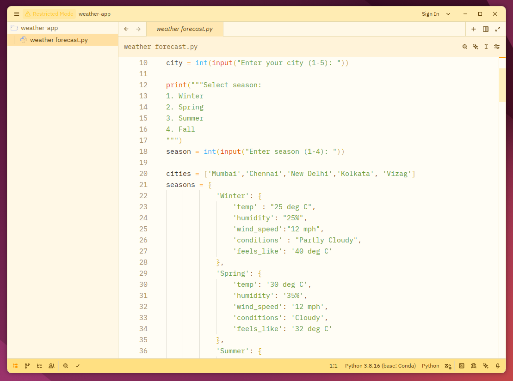
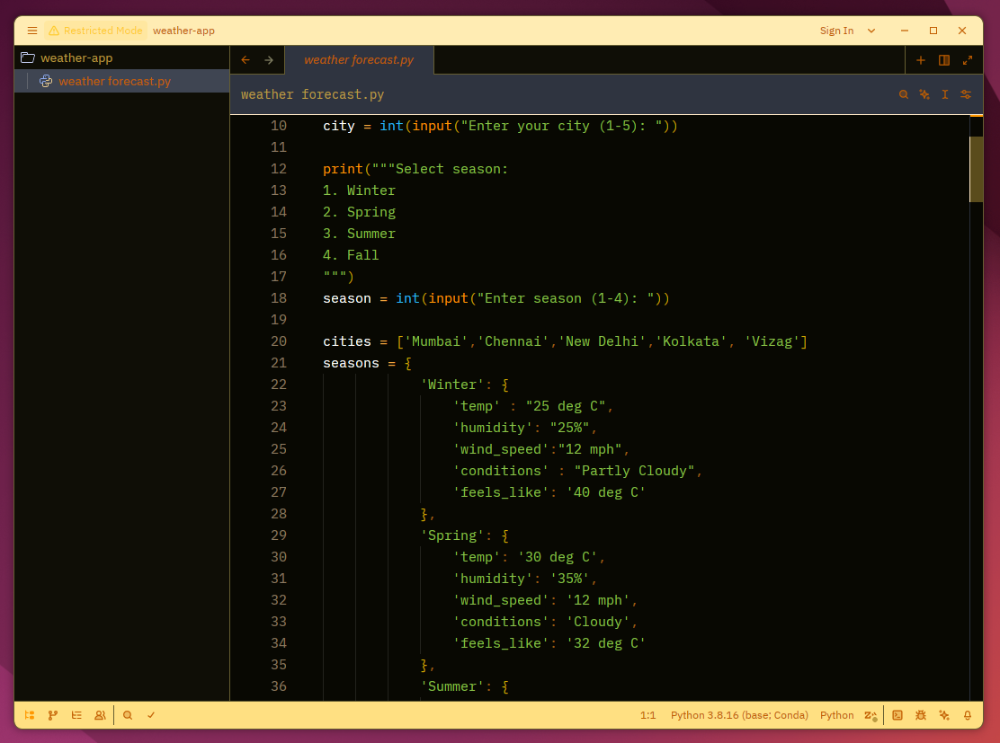

<h3 align="center">
  Sunrise Bloom theme for <a href="https://zed.dev/">Zed IDE</a>
</h3>

  Sunrise Bloom brings the warmth of a cheerful sunrise to Zed. With golden yellows, soft oranges, and balanced cool tones, it creates a fresh, uplifting coding environment that feels like starting your day with the perfect morning light. Bring the energy of a sunrise to your code.

<table align="center">
  <tr>
    <td align="center">
       
      <b>Sunrise Bloom Light</b>
    </td>
    <td align="center">
       
      <b>Sunrise Bloom Dark</b>
    </td>
  </tr>
</table>

### Install via Zed Extensions
1. Open Zed IDE
2. `Cmd+Shift+P` and select *zed: extensions*
3. Search and select *Sunrise Bloom* Theme and click Install

### Install Manually
1. Download [sunrise-bloom.json](./themes/sunrise-bloom.json)
2. Put into `~/.config/zed/themes/`